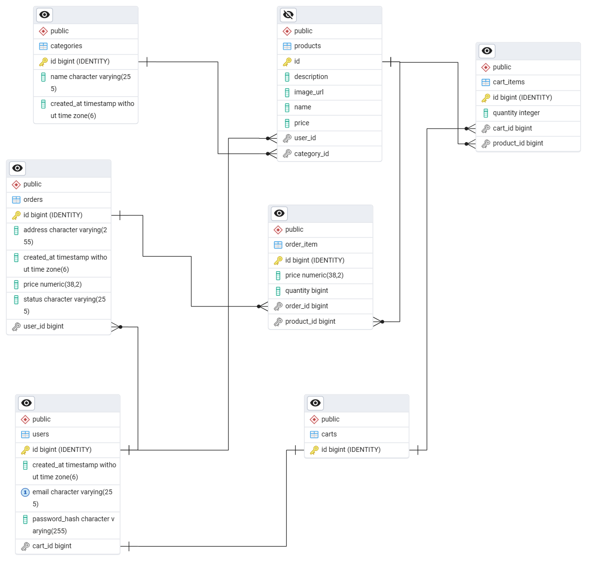

# 🛒 Marketplace Web Application

A full-stack e-commerce web application built with **Spring Boot** and **React**, featuring JWT-based authentication, and complete order processing flow.

---

## 🚀 Overview

This project is a production-style marketplace platform that allows users to:

- Register and authenticate securely
- Browse products by category
- Add products to cart
- Place orders

The system follows a layered backend architecture and communicates with a React frontend via RESTful APIs.

---

## 🏗 Architecture

### Backend (Spring Boot)

The backend follows a standard layered architecture:

Controller → Service → Repository

Key architectural features:

- RESTful API design
- DTO-based request/response handling
- Global exception handling
- JWT-based authentication
- Stateless session management
- JPA/Hibernate ORM
- PostgreSQL relational database

---

### Frontend (React)

The frontend application:

- Uses component-based architecture
- Implements protected routes
- Stores JWT token for authenticated requests
- Provides dynamic updates
- Separates UI logic from API logic

---

## 🔐 Authentication & Security

- User authentication implemented using JWT
- Password hashing with Spring Security
- Stateless backend (no server-side sessions)
- Token validation via authentication filter

---

## 📦 Features

### User Features
- User registration & login
- Browse products
- View product details
- Add/remove items from cart
- Place orders
- View order history
- Add products
- Add categories

---

## 🗄 Database Design

The relational schema includes:

- User
- Product
- Category
- Cart
- CartItem
- Order
- OrderItem

Entity relationships are mapped using JPA annotations.

---

## 🛠 Tech Stack

### Backend
- Java
- Spring Boot
- Spring Security
- JWT
- Spring Data JPA
- Hibernate
- PostgreSQL

### Frontend
- React
- CSS